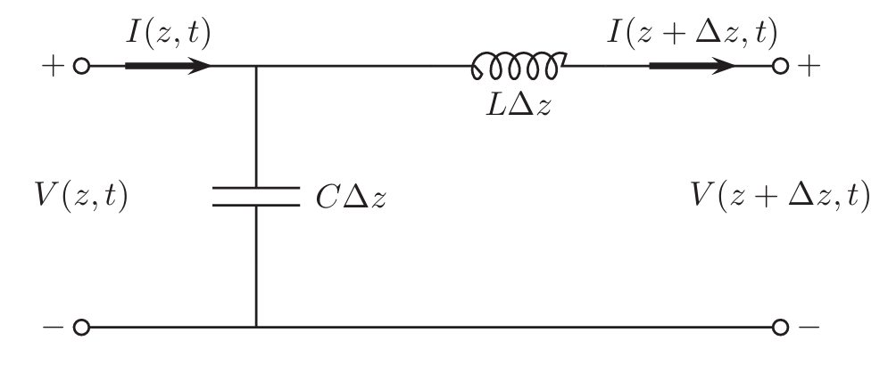
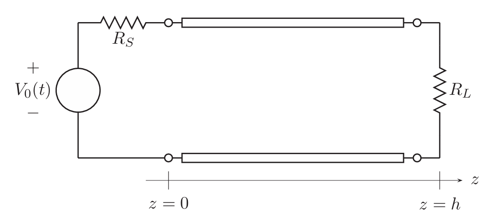
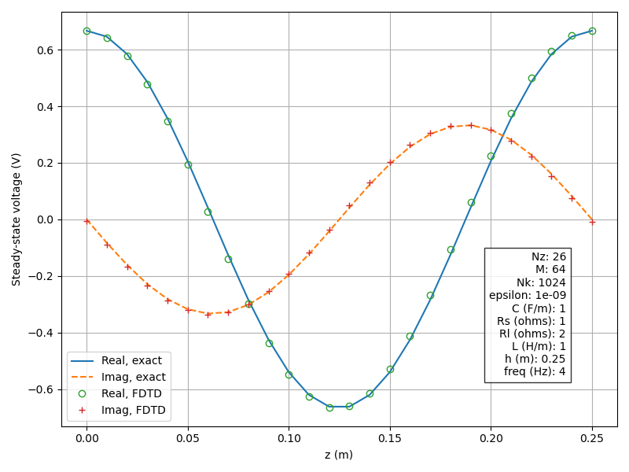
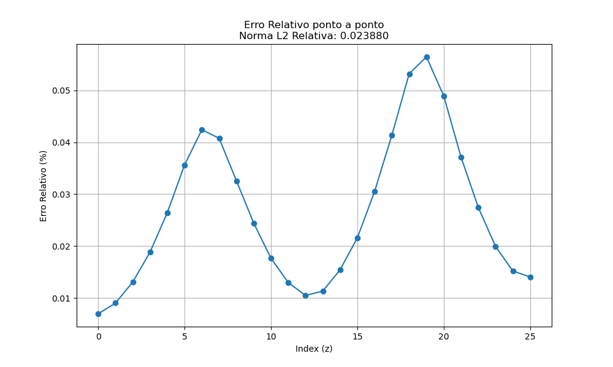
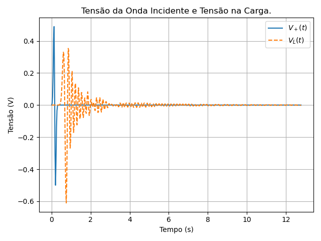
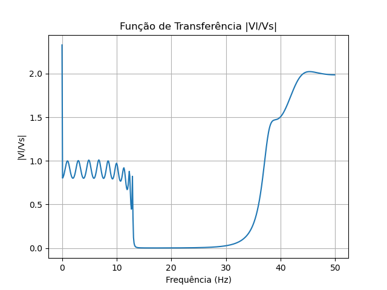
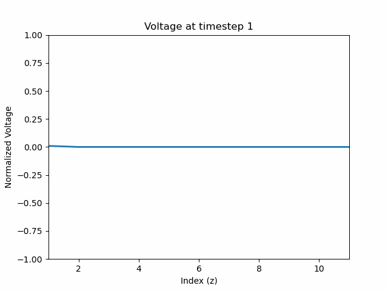

# Capítulo 2 - Simulações FDTD 1D

Este diretório contém a tradução para C++ dos códigos MATLAB do Capítulo 2 do livro:

> D.B. Davidson, *Computational Electromagnetics for RF and Microwave Engineering*, Cambridge University Press, 2ª edição.

## Estrutura

```
Cap_02/
├── src/
│   ├── fdtd_1D_demo.cpp             # Simulação FDTD 1D com senoide
│   ├── fdtd_1D_WB_demo.cpp          # Simulação FDTD 1D banda larga
├── scripts/
│   ├── plot_fdtd_results.py        # Visualização de resultados da senoide
│   └── plot_fdtd_wb_results.py     # Visualização de resultados banda larga
├── out/                            # Saídas geradas pelos simuladores
└── README.md                       # Este arquivo
```

## 📚 Teoria: Linha de Transmissão e Método FDTD

Para introduzir o algoritmo **FDTD (Finite-Difference Time-Domain)**, estudamos o problema de uma **linha de transmissão sem perdas** (lossless transmission line).

Segundo a teoria da linha de transmissão, no modo TEM (Transverse Electromagnetic), há uma correspondência direta entre os campos e as grandezas elétricas:

- Campo elétrico ($E$) ↔ Tensão ($V$)
- Campo magnético ($H$) ↔ Corrente ($I$)

👉 Portanto, resolver para **$V(z,t)$** e **$I(z,t)$** é equivalente a resolver as **equações de Maxwell** para os campos no modo TEM.

A linha de transmissão pode ser modelada por um circuito equivalente **infinitesimal**, composto por uma indutância **$L$** (por metro) e uma capacitância **$C$** (por metro), como mostra a figura:

<p align="center">
  
</p>

**Figura 2.1:** Trecho infinitesimal de uma linha de transmissão unidimensional.
---

### 📐 **Equações da Linha de Transmissão** 

A tensão e a corrente ao longo da linha são descritas pelas **[equações do telegrafista](https://pt.wikipedia.org/wiki/Equa%C3%A7%C3%B5es_do_telegrafista) ([telegraphist's equations](https://en.wikipedia.org/wiki/Telegrapher%27s_equations)):** (eq. 2.13 e eq. 2.14)

$$
\frac{\partial I(z,t)}{\partial z} = -C \frac{\partial V(z,t)}{\partial t}
$$
$$
\frac{\partial V(z,t)}{\partial z} = -L \frac{\partial I(z,t)}{\partial t}
$$

Essas equações são um **caso especial das equações de Maxwell em uma dimensão.**

---

### 🎯 **Modelagem**

Em vez de desacoplar essas equações para obter a equação de onda (equação diferencial parcial de segunda ordem), aqui trabalhamos **diretamente com o par de equações acopladas de primeira ordem.** Isso permite aplicar o método FDTD de forma natural.

O problema modelado é ilustrado na Figura a seguir e considera os seguintes parâmetros normalizados:

- $L = 1$ H/m
- $C = 1$ F/m
- Passo espacial $h = 0.25$ m
- Resistência da fonte $R_S = 1$ $\Omega$
- Resistência de carga $R_L = 2$ $\Omega$

<p align="center">
  
</p>

**Figura 2.2:** Problema modelado da linha de transmissão.

Com esses valores:

- Impedância característica $Z_0 = \sqrt{\frac{L}{C}} = 1$ $\Omega$
- Velocidade de propagação $v_p = \frac{1}{\sqrt{LC}} = 1$ m/s

> 🔍 **Nota:** Este é um modelo **normalizado**, frequentemente usado em física para simplificar as equações e interpretação dos resultados.

---

### 💡 **Objetivo**

A partir dessas equações, o método FDTD permite calcular a evolução temporal das tensões e correntes ao longo da linha, gerando:

1. O comportamento no **domínio do tempo** $V(z,t)$ e $I(z,t)$
2. A **função de transferência** $|V_L / V_S|$ via Transformada de Fourier
3. Animações da propagação da tensão ao longo da linha

---

## Requisitos

### Compilação C++
- C++17 ou superior
- [FFTW3](http://www.fftw.org/) (Fastest Fourier Transform in the West)
- CMake
- pkg-config
- Compilador compatível com C++17 (ex.: `g++`, `clang++`)

### Bibliotecas de Desenvolvimento
Instale os pacotes necessários no Ubuntu/Debian com:

```bash
sudo apt install build-essential gfortran cmake pkg-config libfftw3-dev
````

### Python 3 (para visualização de resultados)

Os scripts de visualização requerem as seguintes bibliotecas:

* numpy
* pandas
* matplotlib
* pillow
* ffmpeg (externo, usado pelo matplotlib)

Instale com:

```bash
sudo apt install python3 python3-pip python3-numpy python3-matplotlib python3-pandas python3-pil ffmpeg
```

ou via `pip`:

```bash
pip install numpy matplotlib pandas pillow
```

---

## Compilação (exemplo)

```bash
cd Cap_02
mkdir build && cd build
cmake ..
make
```

## Execução e Visualização

Execute os binários gerados dentro de `build/`:

```bash
./fdtd_1D_demo
./fdtd_1D_WB_demo
```

E visualize os resultados com:

```bash
cd ../scripts
python3 plot_fdtd_results.py
python3 plot_fdtd_wb_results.py
```

## Saídas geradas e suas interpretações `fdtd_1D_demo` (Senoide)

As imagens são salvas na pasta `Cap_02/out/`. Veja abaixo algumas delas:

### 📈 `comparison_voltage_plot.png`

> **Tensão no tempo final** da simulação senoidal (`fdtd_1D_demo`). Mostra a distribuição espacial da tensão após a convergência, juntamente com a solução analítica. Para verificar os parâmetros de execução, consulte o arquivo gerado: [Ver arquivo CSV](./out/simulation_parameters.csv).

<p align="center">
  
</p>

---

### 🌡️ `erro_relativo.png`

> **Erro relativo percentual** ao longo do espaço, correspondente aos valores do gráfico anterior.

<p align="center">
  
</p>

---

### ⚡ `voltage_simulation.gif`

> **Animação da evolução temporal da tensão** $V(z,t)$ ao longo do espaço.

<p align="center">
  
</p>

---

### 🔌 `current_simulation.gif`

> **Animação da evolução temporal da corrente** $I(z,t)$ ao longo do espaço.

<p align="center">
  
</p>

---

## Cálculo wideband `fdtd_1D_WB_demo`

> No contexto do método FDTD, o cálculo *wideband* consiste em excitar a linha de transmissão (ou outro sistema) com um sinal de banda larga e, a partir da Transformada de Fourier aplicada na resposta temporal, obter a resposta do sistema para diversas frequências em uma única simulação.

---

### 🕒 `wb_time_response.png`

> Gráfico da resposta temporal: tensão do pulso incidente $V_+(t)$ e tensão na carga $V_L(t)$ (simulação *wideband*).

<p align="center">
  
</p>

---

### 📡 `wb_transfer_function.png`

> Função de transferência $|V_L / V_O|$ obtida a partir da Transformada de Fourier dos sinais de entrada e saída.

<p align="center">
  
</p>

---

### ⚡ `WB_voltage_simulation.gif`

> Animação da evolução espacial da tensão $V(z,t)$ ao longo da linha de transmissão ao longo do tempo.

<p align="center">
  
</p>

## Ligação com README geral

Este é o módulo correspondente ao **Capítulo 2** do livro. Consulte o [README principal](../README.md) para acessar os demais capítulos.
