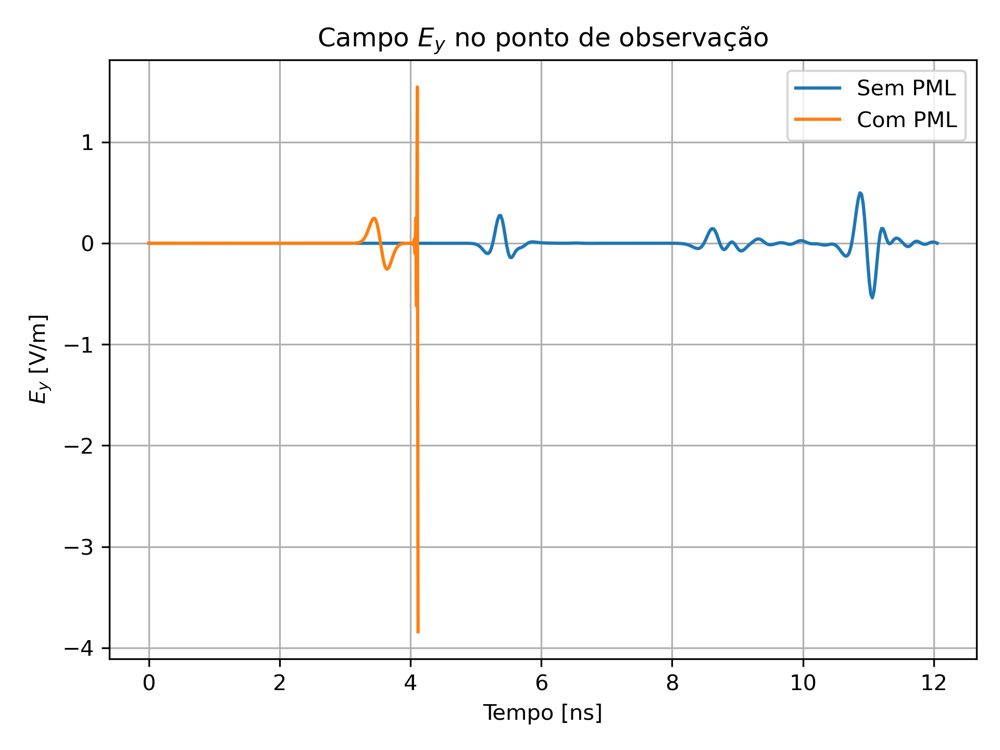
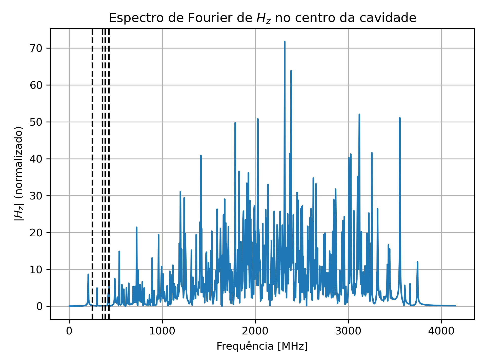

# Capítulo 3 – FDTD 2D e 3D (Tradução para C++)

Este diretório implementa em C++ os códigos do Capítulo 3 do livro:

**D.B. Davidson**, *Computational Electromagnetics for RF and Microwave Engineering*, Cambridge University Press, 2ª ed., 2010.

---

## 📁 Estrutura atual

```
Cap_03/
├── include/
│   ├── fdtd2d.hpp
│   ├── fdtd2d_pml.hpp
│   └── fdtd3d.hpp
├── src/
│   ├── fdtd2d.cpp
│   ├── fdtd2d_pml.cpp
│   ├── fdtd3d.cpp
│   └── gaussder.cpp
├── plots/
│   ├── plot_fdtd_ey.py
│   └── plot_fdtd3d_fft.py
├── out/
│   ├── ey_point1.csv
│   ├── ey_point1_pml.csv
│   ├── hz_center_fft.csv
│   └── hz_center_fft_plot.png
├── main.cpp
├── CMakeLists.txt
└── README.md
```

---

## 🚀 Compilação e Execução

```bash
mkdir build && cd build
cmake ..
make
```

### Executáveis:

- `./fdtd2d` — Simulação 2D com campo total/disperso e fronteiras ABC
- `./fdtd2d_pml` — Simulação 2D com camada absorvente PML
- `./fdtd3d` — Simulação 3D com cavidade retangular PEC e análise espectral

---

## 📊 Visualizações

- `plot_fdtd_ey.py`: compara os campos \( E_y \) com e sem PML
- `plot_fdtd3d_fft.py`: plota o espectro da FFT do \( H_z \) no centro da cavidade

Para rodar os gráficos:

```bash
python3 plots/plot_fdtd_ey.py
python3 plots/plot_fdtd3d_fft.py
```

---

## 📌 Descrição dos Experimentos

### 🔹 `fdtd2d`
- Espalhamento de pulso TE por cilindro PEC
- Fonte Gaussiana derivada
- Condições de contorno ABC (absorventes)

### 🔸 `fdtd2d_pml`
- Mesmo cenário do anterior, com implementação de PML (Perfectly Matched Layer)
- Camada absorvente com perfil polinomial

### 🔷 `fdtd3d`
- Cavidade PEC com dimensões \(1 \times 0.5 \times 0.75\) m
- Modo dominante TE101
- Análise espectral via FFT
- Frequências comparadas com valores analíticos

---

## 📸 Exemplos de Saídas Geradas

### 🟢 Comparação do Campo \( E_y \) com e sem PML

> Campo elétrico \( E_y \) registrado ao longo do tempo em um ponto fixo da malha 2D.  
> A linha sólida representa a simulação com ABC; a tracejada, com PML.  
> A diferença entre as curvas evidencia o desempenho superior da PML em absorver a onda incidente sem reflexões artificiais.



---

### 🔵 Espectro de \( H_z \) na Cavidade 3D

> Magnitude da FFT do campo magnético \( H_z \) no centro da cavidade PEC \(1 \times 0{,}5 \times 0{,}75\) m.  
> As linhas verticais tracejadas representam os modos TE analíticos da cavidade, permitindo comparação direta com os picos simulados.




---

📚 Este capítulo faz parte do repositório de tradução dos códigos MATLAB para C++, com foco em fidelidade física, extensibilidade computacional e documentação didática.
